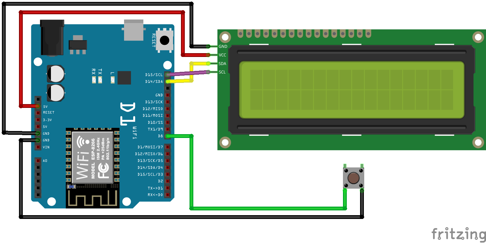

# <p align="center"> ⏰🌦️ Time Weather Clock - ESP8266 🌦️⏰ </p>
This project is an ESP8266-based smart clock that fetches weather and time data from APIs and displays it on a screen.

## Table of Contents
* [Project Description](#project-description)
* [Configuration](#configuration)
  * [Wi-Fi Setup](#wi-fi-setup)
  * [SSL Configuration](#ssl-configuration)
  * [Connection Setup](#connection-setup)
  * [API Configuration](#api-configuration)
  * [Other Customizations](#other-customizations)
* [Requirements](#requirements)
* [Getting Started](#getting-started)

# Project Description
The "Time Weather Clock - ESP8266" project is an intelligent clock that uses the ESP8266 module to fetch current weather data and time. To use this clock, it requires a Wi-Fi connection. Also it retrieves data using SSL (Secure Sockets Layer) for secure communication.  
The project is flexible and can be customized to suit your needs.

# Configuration
In order to run the project, it is necessary to configure all the following settings described in the below sections.

## Wi-Fi Setup
To configure the Wi-Fi connection open the [secrets.hpp](include/secrets.hpp) file.  
Enter your Wi-Fi network name and password:
```cpp
const char* ssid = "YourNetworkName";
const char* password = "YourPassword";
```

## SSL Configuration
To set up a connection to external APIs using SSL, you need to obtain a SSL Certificates of the APIs you want to use.  
Then open the [GenericHttpClient.hpp](lib\Utils\GenericHttpClient\include\GenericHttpClient.hpp) file and paste certificates in PEM format.

```cpp
const char TIME_API_ROOT_CA [] PROGMEM = R"CERT(
-----BEGIN CERTIFICATE-----
<SSL Certificate to worldtimeapi API>
-----END CERTIFICATE-----
)CERT";

const char WEATHER_API_ROOT_CA [] PROGMEM = R"CERT(
-----BEGIN CERTIFICATE-----
<SSL Certificate to openweathermap API>
-----END CERTIFICATE-----
)CERT";
```

## Connection Setup
Connect all parts as shown in the sketch below:  


## API Configuration
To connect to the [openweathermap API](https://openweathermap.org/api), you need to obtain an API Key and City Id.  
Paste this data to the [secrets.hpp](include/secrets.hpp) file:
```cpp
#define OPEN_WEATHER_MAP_API_KEY "xxx"
#define CITY_ID "xxx"
```

## Other Customizations
The project allows you to customize the interval to refresh data from APIs and timing of different views on the clock. Edit the [config.hpp](include/config.hpp) file to adjust this parameters:

```cpp
#define TIME_TO_REFRESH_DATA_SEC (20 * 60)  // interval to refresh data from API (20 minutes)

#define SHOW_TIME_DATA_SEC 5                // timing to show time data on screen
#define SHOW_WEATHER_DATA_SEC 4             // timing to show weather data on screen

#define BACKLIGHT_PIN D8                    // pin to connect the button that changes the backlight
#define CITY_NAME "YourCityName"
#define NTP_CONNECTION_TIMEOUT_MS 10000     // time to retry synchronization with NTP server
```

# Requirements
 - ESP8266 module
 - LCD I2C 2x16
 - Access to a Wi-Fi network
 - Access to a openweathermap API

# Getting Started
 - Set up the hardware and install the necessary libraries using [PlatformIO](https://platformio.org/).  
 - Configure the project as presented in the [Configuration](#configuration) section.  
 - Upload the software to the ESP8266 module.
